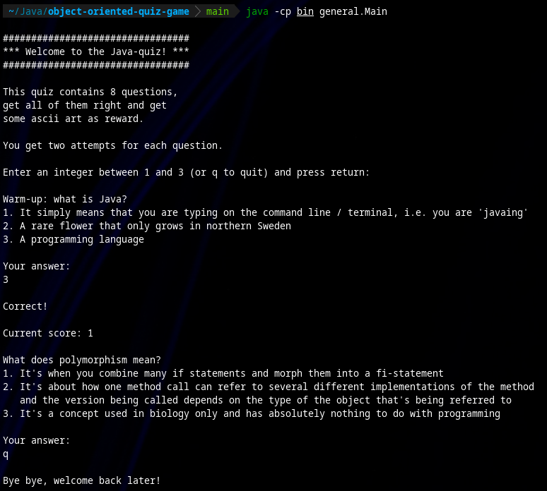

## Description

Written as part of a Java course.

## Requirements

Works at least with OpenJDK 17.0.9 but probably other versions as well.

## Compile and run

`git clone https://github.com/sparkhound772/object-oriented-quiz-game.git`

`cd object-oriented-quiz-game`

Compile in this order to avoid "cannot find symbol"-errors and such:

`javac -d bin -cp bin src/general/Question.java`

`javac -d bin -cp bin src/questions/*`

`javac -d bin -cp bin src/general/GameLogic.java`

`javac -d bin -cp bin src/general/Main.java`

Then run:

`java -cp bin general.Main`

## Future improvements

It was in hindsight unnecessary to make a separate class for every question, and there are for sure more elegant solutions. If some version of this program is needed in the future that and possibly other things will be fixed.

## Thanks to

Deitel, P., Deitel, H. (2020). _Java, How to program, Late objects._ 11th edition. Person.

Specifically Chapter 10 for the help with the polymorphism between the Question interface and the implementing classes.
